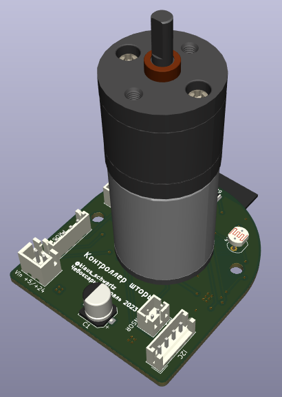
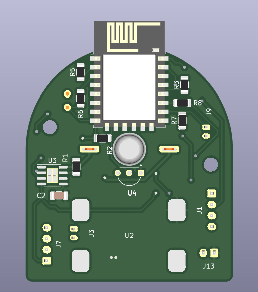
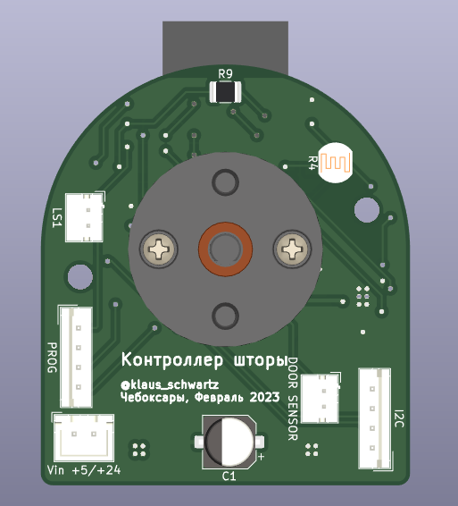

# Контроллер умного окна

[.float-group]
--

Устройство для управления рулонной шторой. Умеет:

1. Прятаться внутри трубы рулонной шторы. Ставится с другого конца от механической крутилки и имеет такой же габарит. Механическая крутилка сохраняется т.к. вручную шторами тоже удобно управлять.
2. Двигать шторой, в том числе зеброй.
3. Датчиком освещенности следить, чтобы шторы пропускали необходимое количество света.может делиться этой инфой с другими шторами.
4. Датчиком холла контролить текущее положение шторы, даже если шторой управляют вручную через цепочку.
5. Автокалибровать положения полностью свернутой шторы концевиком если пропало электричество и штору двигали вручную.
6. Общаться с дополнительной переферией по i2c / uart (если есть).
7. Опрашивать датчик открытого окна (если есть).
--

## Печатные платы

Дизайн в kicad. Печатная плата распаивается непосредственно на двигатель.

[.float-group]
--

--

## Корпус и другие детали

Печатается на 3D принтере. Дизайн в openscad. Часть деталей предназначена для стыковки вала двигателя с трубой
для рулонных штор ø32мм, остальная часть — для крепления двигателя и печатной платы к окну/стене/раме.

Список деталей:

. Чехол для стыковки вала и трубы 32мм;
. Корпус контроллера с хомутным соединением с корпусом двигателя и винтовым с печатной платой;
. Кронштейн для крепления к окну конца трубы с двигателем;
. Звездочка для шариковой цепи с креплением к 32мм трубе;
. Кронштейн для крепления к окну конца трубы со звездочкой.

## Покупные компоненты

. Ткань для рулонной шторы;
. Труба для рулонных штор ø32мм;
. Двигатель с редуктором JGA25-370;
. Блок питания AC 220 -> 12V для питания двигателя;
. Полномостовой драйвер A4950;
. DC-DC преобразователь 5-25V -> 3.3V;
. ESP8266-12E / ESP8266-12F;
. (опция) SMD или DIP фоторезистор (LDR) — для них на плате предусмотрено 2 места. Можно сделать выносным.
. (опция) концевой выключатель — подключается через JST-PH (2мм шаг) разъём. Open drain.
. (опция) датчик открытия окна — подключается через JST-PH (2мм шаг) разъём. Open drain.
. (опция) I2C периферия — подключается через JST-EH (2.5мм шаг) разъём. Питание 3.3В.
. (опция) UART периферия — подключается через JST-EH (2.5мм шаг) разъём программирования. Питание нужно брать от разъёма I2C.

## Выбор двигателя

На 100-200 оборотов в минуту. Большее число оборотов теоретически может не дать нужного крутящего момента, меньшее число оборотов может сделать ручное раскручивание шторы проблематичным. Крутящий момент при 100 оборотах в минуту у большинства двигателей будет порядка 1 кг для барабана шторы с радиусом 2 см.

## Прошивка

Открытая прошивка ESPHome. Плата имеет разъёмы для загрузки собственной прошивки.
